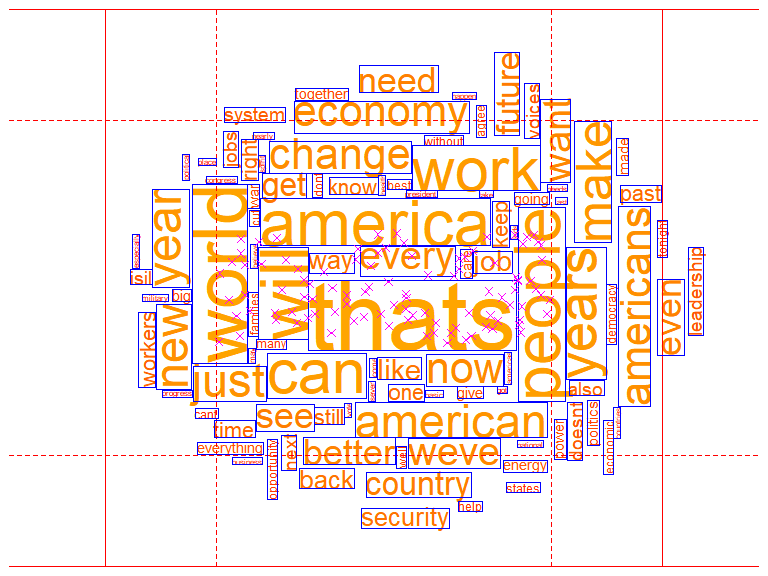

<!-- README.md is generated from README.Rmd. Please edit that file -->

# cloudr

<!-- badges: start -->

<!-- badges: end -->

**This is a personal project that is in development - it is not working
properly**

Just for fun, I’ve had a go at producing word cloud type graphics in R.
At the moment, it’s slow and clunky. Personally I don’t believe that
word clouds are a particularly useful or insightful way to visualise
text analysis, but I do think they can look rather pretty and be good
fun to make.

I’m not really interested in developing code to extract words and their
respective weights from a body of text. Here I am just interested in how
to place the words (scaled to their weighting) on the page in the form
of a word cloud. As such, the code im developing here needs to be
supplied with a vector of words and a vector of their weights from which
a word cloud will be generated.

## Add package to search path

``` r
library(cloudr)
```

## Default data set

`cloudr` has a raw data set `obama` - a dataframe of words and their
weights from Obama’s 2016 state of the union speech downloaded from
<https://help.xlstat.com/customer/en/portal/articles/2918639-word-cloud-tutorial-in-excel-?b_id=9283>

``` r
obama[1:10, ]
#> # A tibble: 10 x 2
#>    word    count
#>    <chr>   <dbl>
#>  1 thats      30
#>  2 world      24
#>  3 will       22
#>  4 america    21
#>  5 people     21
#>  6 can        20
#>  7 work       20
#>  8 years      18
#>  9 make       17
#> 10 year       17
```

## Create word cloud

``` r
wc(obama$word[1:100], obama$count[1:100], 
   seed=4,
   lower_cex = 0.5, 
   upper_cex = 6,
   lo_col = "grey",
   markup = FALSE)
```


``` r

wc(obama$word[1:100], obama$count[1:100], 
   seed=4,
   lower_cex = 0.5, 
   upper_cex = 6,
   hi_col = "orange",
   lo_col = "red",
   markup = TRUE)
```


