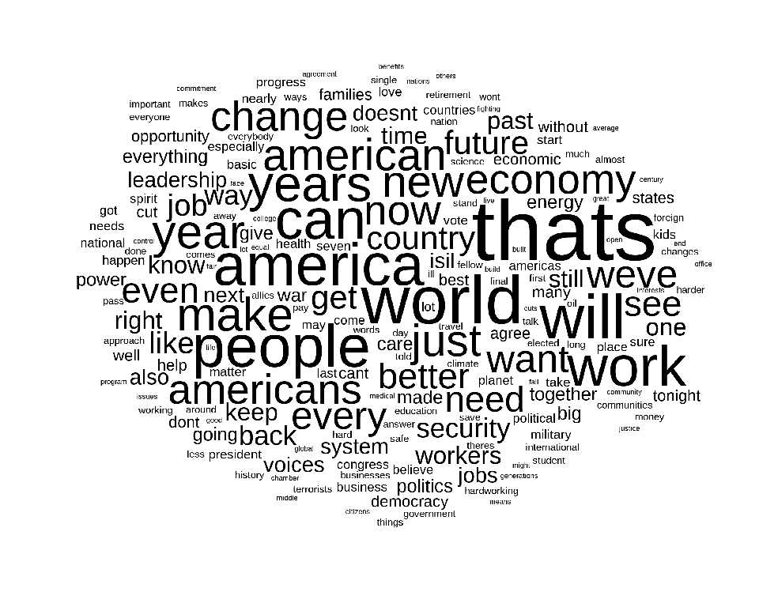
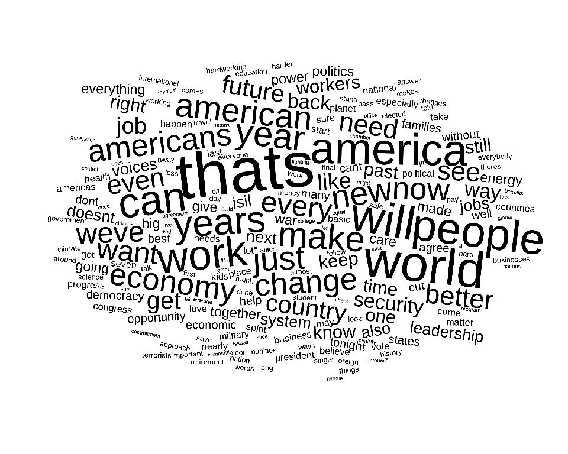
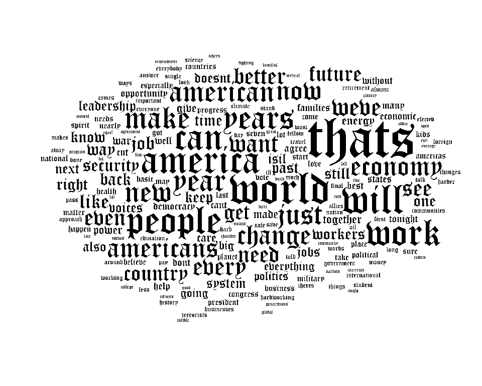

<!-- README.md is generated from README.Rmd. Please edit that file -->

# cloudr - bitmap (using fontr)

<!-- badges: start -->

<!-- badges: end -->

## **This is a personal project and a work in progress. It is not working properly**

I’ve had a go at producing word cloud type graphics in R in order to
learn and devlop my coding skill. Personally I don’t believe that word
clouds are a particularly useful or insightful way to visualise text
analysis, but I do think they can look rather pretty and be good fun to
make.

This ‘bitmap’ version of `cloudr` uses Yixuan’s rather marvellous
[fontr](https://github.com/yixuan/fontr) package in order to return
bitmaps of the character glyphs. This allows for much faster collision
detection of matrices.

## Add package to search path

``` r
library(cloudr)
```

## Default data set

`cloudr` has a raw data set `obama` - a dataframe of words and their
weights from Obama’s 2016 state of the union speech downloaded from
<https://help.xlstat.com/customer/en/portal/articles/2918639-word-cloud-tutorial-in-excel-?b_id=9283>

``` r
obama[1:10, ]
#> # A tibble: 10 x 2
#>    word    count
#>    <chr>   <dbl>
#>  1 thats      30
#>  2 world      24
#>  3 will       22
#>  4 america    21
#>  5 people     21
#>  6 can        20
#>  7 work       20
#>  8 years      18
#>  9 make       17
#> 10 year       17
```

## Create word clouds

``` r
bmwc(cloudr::obama[1:200,], seed = 42)
#> All words placed
```



``` r
bmwc(cloudr::obama[1:200,], angle_range = c(-10,10), seed = 42)
#> All words placed
```



### Change font

``` r
sysfonts::font_add(family = "old_eng", "C:/Windows/Fonts/OLDENGL.TTF")
bmwc(obama[1:200,], font_family = "old_eng", seed=42)
#> All words placed
```



``` r
bmwc(obama[1:200,], font_family = "old_eng", seed=42, angle_range = c(-25,25))
#> All words placed
```


