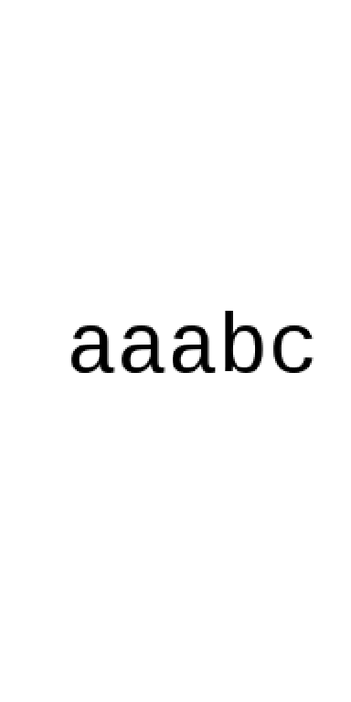

<!-- README.md is generated from README.Rmd. Please edit that file -->

# cloudr

<!-- badges: start -->

<!-- badges: end -->

**This is a personal project. It is just for fun and it is not working
properly at the moment**

I’ve had a go at producing word cloud type graphics in R in order to
learn and devlop my coding skill. Personally I don’t believe that word
clouds are a particularly useful or insightful way to visualise text
analysis, but I do think they can look rather pretty and be good fun to
make.

I’m not really interested in developing code to extract words and their
respective weights from a body of text. Here I am just interested in how
to place the words (scaled to their weighting) on the page in the form
of a word cloud. As such, the code im developing here needs to be
supplied with a vector of words and a vector of their weights from which
a word cloud will be generated.

## Add package to search path

``` r
library(cloudr)
```

## Default data set

`cloudr` has a raw data set `obama` - a dataframe of words and their
weights from Obama’s 2016 state of the union speech downloaded from
<https://help.xlstat.com/customer/en/portal/articles/2918639-word-cloud-tutorial-in-excel-?b_id=9283>

``` r
obama[1:10, ]
#> # A tibble: 10 x 2
#>    word    count
#>    <chr>   <dbl>
#>  1 thats      30
#>  2 world      24
#>  3 will       22
#>  4 america    21
#>  5 people     21
#>  6 can        20
#>  7 work       20
#>  8 years      18
#>  9 make       17
#> 10 year       17
```

## Create word cloud

### Straight wordcloud

``` r
cloudr::bmwc(cloudr::obama[1:200,],
             min_size = 30,
             max_size = 350,
             spiral_step = 40,
             spiral_length = 100,
             angle_range = c(0, 0),
             buffer = 5,
             seed = 1)
#> All words placed
```


``` r
cloudr::bmwc(cloudr::obama[1:50,],
             min_size = 30,
             max_size = 350,
             v_buffer = 48,
             h_buffer = 30,
             spiral_step = 20,
             spiral_length = 80,
             angle_range = c(0, 0),
             buffer = 5,
             seed = 1)
#> All words placed
```


### A little bit of wobble

``` r
cloudr::bmwc(cloudr::obama[1:200,],
             min_size = 30,
             max_size = 350,
             spiral_step = 40,
             spiral_length = 100,
             angle_range = c(-5, 5),
             buffer = 5,
             seed = 1)
#> All words placed
```


### Random angles

``` r
cloudr::bmwc(cloudr::obama[1:200,],
             min_size = 30,
             max_size = 350,
             spiral_step = 40,
             spiral_length = 100,
             angle_range = c(-90, 90),
             buffer = 5,
             seed = 1)
#> All words placed
```


### Change font

``` r
sysfonts::font_add(family = "old_eng", "C:/Windows/Fonts/OLDENGL.TTF")

cloudr::bmwc(cloudr::obama[1:200,],
             min_size = 30,
             max_size = 350,
             spiral_step = 40,
             spiral_length = 100,
             angle_range = c(-5, 5),
             buffer = 5,
             seed = 1,
             font_family = "old_eng")
#> All words placed
```


\#\#\#Increase word buffer

``` r
cloudr::bmwc(cloudr::obama[1:200,],
             min_size = 30,
             max_size = 350,
             spiral_step = 40,
             spiral_length = 100,
             angle_range = c(0, 0),
             buffer = 25,
             seed = 1)
#> All words placed
```



## Example of buffer

``` r
word <- word_mat("aaaaabbbbb", weight=50, rot=0)
plot_mat(word)
```


``` r

plot_mat(add_buffer(word, buffer = 10, fill = 50))
```


